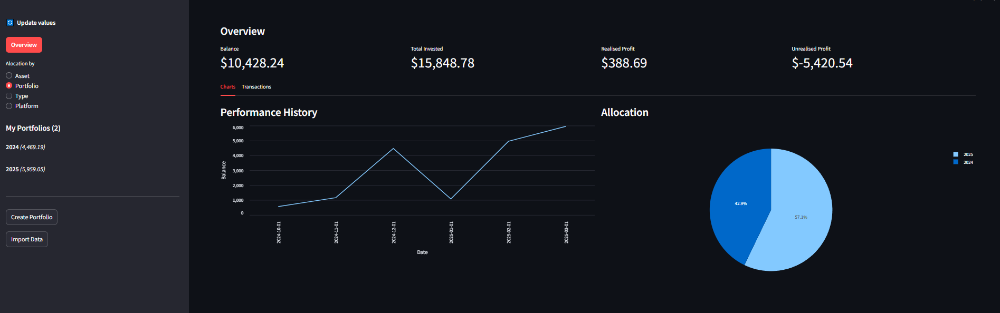

# Portfolio Tracker

A comprehensive cryptocurrency portfolio management application built with Python, Streamlit, and SQLite. Track your crypto investments across multiple portfolios, monitor performance, and analyze asset allocations in real-time.

## Features

### Portfolio Management
- **Multi-Portfolio Support**: Create and manage multiple investment portfolios
- **Real-time Price Tracking**: Automatic cryptocurrency price updates
- **Performance Analytics**: Track portfolio value, profits, and returns over time
- **Asset Allocation**: Visual breakdown of portfolio composition
- **Transaction History**: Complete record of all buy/sell transactions

### Data Management
- **CSV/Excel Import**: Import transaction data from various platforms
- **Platform Support**: Currently supports Binance (more exchanges planned)
- **Data Normalization**: Automatic handling of different data formats
- **Local Storage**: Secure SQLite database for all portfolio data

### User Interface
- **Modern Dashboard**: Clean, intuitive interface built with Streamlit
- **Interactive Charts**: Visual representation of portfolio performance
- **Asset Overview**: Detailed metrics for each cryptocurrency
- **Responsive Design**: Works well on desktop and tablet devices

## Screenshots

### Dashboard Overview

*Main dashboard showing portfolio performance, asset allocation, and key metrics*

### Data Import Interface

*Easy-to-use interface for importing transaction data from CSV or Excel files*

### Asset Allocation

*Visual breakdown of portfolio composition and asset distribution*

### Transaction History

*Detailed view of all transactions with filtering and sorting capabilities*

## Modular Structure

The application uses a modular architecture for processing data from different cryptocurrency exchanges. Each exchange has its own module in the `modules/` directory that handles the specific data format and requirements.

### Current Implementation
- ✅ **Binance Module**: Fully implemented 
  - Supports CSV transaction history export
  - Handles buy/sell transactions
  - Maps exchange-specific fields to standard format
    - *Export Trade Order history within 6 months*

### Adding New Exchange Support
The modular structure allows easy integration of new exchanges. Each module needs to implement:
1. `clean_data(df)`: Transform exchange-specific data format
2. Column mapping for standardization:
   ```python
   column_mapper = {
       'Exchange Column': 'Standard Column',
       'Date(UTC)': 'Date',
       'Type': 'Action',
       # ... other mappings
   }
   ```

### Planned Exchange Support
- 🔄 Kraken
- 🔄 Coinbase
- 🔄 KuCoin

## Data Processing Flow

### Import Process
1. User uploads transaction file. Might also be loaded directly drom data/ 
2. System detects file type (CSV/Excel) and exchange
3. Exchange-specific module processes the data
4. Data is normalized and saved to database

### Database Updates
- Transactions are stored in `Asset_Transaction` table
- Asset metrics are recalculated
- Portfolio values are updated
- Current prices are fetched and stored

## Known Limitations

1. **Exchange Support**
   - Currently only supports Binance
   - Manual CSV export required
   - No direct API integration yet

2. **Price Updates**
   - Single price source
   - Manual refresh required
   - No historical price tracking

3. **Performance**
   - Large transaction files may be slow
   - No data pagination implemented

4. **Features**
   - No Auth
   - Export is not finished
   - cli flags with poor implementation

## Troubleshooting

### Common Issues

1. **Database Initialization Error**
   - Ensure you have write permissions in the db/ directory
   - Check if database.db exists and is not locked

2. **Import Errors**
   - Verify CSV format matches expected structure
   - Check file encoding (UTF-8 recommended)

3. **Price Update Issues**
   - Verify internet connection
   - Check if asset symbols match expected format
   

## License

This project is licensed under the MIT License - see the LICENSE file for details.
